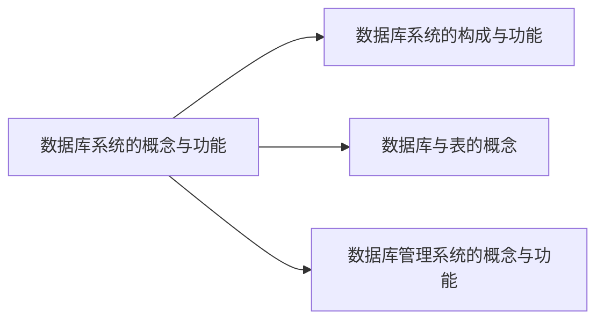
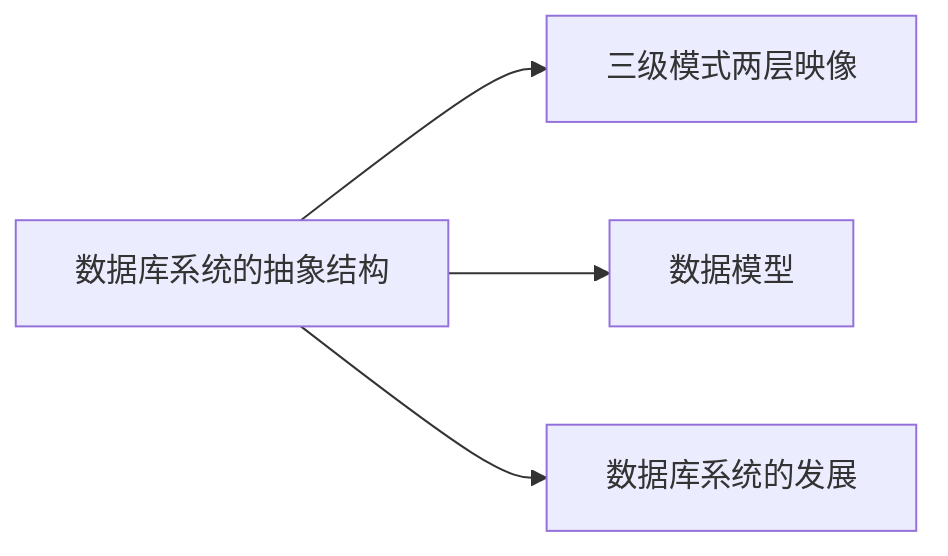

# 模型与语言

## 1 数据库系统概述

### 1.1 数据库系统的概念与功能

---

*数据库系统的构成与功能：*

> Everything Over DB

- 数据库系统的构成
  - 数据库(DB)：DataBase，相互之间有关联关系的表的集合
  
  - 数据库管理系统(DBMS)：DataBase Management System，管理数据库的系统软件
  - 数据库应用(DBAP)：DataBase APplication，完成某种数据库相关功能的应用程序
  - 数据库管理员(DBA)：DataBase Administrator
  - 计算机基本系统
  
- 数据库系统的功能
  - <u>数据库可以实现**信息的积累与运用**</u>
    - 积累：**形成数据库**
    - 运用：将积累的信息转换为**效益**
    - 提供数据库的**管理与控制**功能

  - <u>数据库是**大数据**技术的基础</u> 
    - 只求**关系**，不求因果
    - 从**部分数据集**上的分析，到**全数据集**上的分析

---

*数据库与表的概念：*

- <u>数据库的概念</u>：

  - 数据库是**电子化信息**的集合
  - 数据库是相互之间**有关联关系的表**的集合

- <u>表的概念</u>：以**按行按列**形式组织及展现的数据

  > 表也可以称之为**关系**

- <u>表的构成</u>：

  - 表名
  - 表标题（格式）
  - 表内容（值）
  - 表结构
    - 行(row)/元组(tuple)/记录(record)
    - 列(column)/字段(field)/属性(attribute)/数据项(data item)

- <u>表的作用</u>：

  - 表中描述了一批相互有**关联关系**的数据
  - 基于表提出了**关系及关系模型**，提出了**关系数据库**

---

*数据库管理系统的概念与功能：*

- <u>概述</u>：数据库管理系统一种系统软件，它通过**结构化数据库语言**提供基本的数据库操作功能，运行程序**解析**语言并**执行**对数据库的具体操作

- <u>提供数据库语言(SQL, Structrued Query Language)</u>

    >   主要从**用户使用**的角度讲解

    >   数据库语言：DBMS提供的用于**指示DBMS操作数据库**的语言，相当于高级语言的一个或多个循环程序，可以嵌入高级语言（宿主语言）中使用

    - 数据定义语言(DDL, Data Definition Language)：**定义**数据库中表的名称、标题（包括属性名及对属性值的要求）等**格式**，**创建**数据库和表

        >   也包括对数据库和表的删除、更改、查询

    - 数据操纵语言(DML, Data Manipulation Language)：对数据库中的表进行**增加、删除、更改、检索**等操作

    - 数据控制语言(Data Control Language)：规定**用户**操作**数据**的**权限**，实施对数据库的**控制**

    - 数据库维护程序：提供对数据库维护的功能，包括转储、恢复、重组、性能检测、分析等，一般由DBA使用

- <u>运行系统例行程序</u>

    >   主要从**系统实现**的角度讲解

    >   这些例行程序本质上是用<u>**形式$\rarr$构造$\rarr$自动化**</u>的思想**实现**数据库管理系统

    - **编译**与执行控制程序
        - 将数据库语言翻译成DBMS可执行的命令（DDL编译器、DML编译器、DCL编译器等）
    - **查询**优化与查询实现程序
        - 提高数据库**检索速度**
        - 执行引擎**实现查询**
    - **存储与索引**程序
        - 提供数据在**外存**上的**高效存取**手段
        - 实现存储管理器、缓冲区管理器、索引/文件和记录管理器等
    - **事务**处理程序
        - 提高可靠性，避免并发错误
    - 各种**控制**程序
        - 通信控制：提供网络环境下数据操作与传输手段
        - 故障恢复、安全性和完整性控制
        - 数据库维护和数据字典管理
        - 应用程序接口

    >   详见数据库系统笔记仓库

### 1.2 数据库系统的抽象结构

---

*三级模式两层映像：*

- :star:<u>**三级模式两层映像**是数据库系统的标准结构</u>

- <u>DBMS管理**数据**的三个层次</u>：

  - 外部层次/用户层次：某一**用户**能处理的数据，是全局数据的**一部分**

    > 强调**局部性**

  - 概念层次/逻辑层次：**全局**管理的数据，包含**关联约束**

    > 强调**全局性**

  - 内部层次/物理层次：**存储**在介质上的数据，包含存储路径、存储方式、存储索引等

    > **强调物理存储**

- <u>**模式、视图、映像**的概念</u>：

  - 模式(Schema)：对数据库中数据的**结构性描述**，表现数据的**结构信息**
  - 视图(View)/数据(Data)：某一种**结构**下数据库中的**数据**
  - 映像(Mapping)：一种结构到另一种结构的**映射**

- **<u>三级模式</u>**：

  - 局部/外部/外/用户/子 模式(External Schema)：某一**用户**能处理的**数据的结构描述**

    - 局部/外部/外/用户/子 视图(External View)：某一用户能处理的**数据**

      > 可以简称为**视图**

  - 全局/概念/逻辑 模式(Conceptual Schema)：**全局**管理的**数据的结构描述**

    > 可以简称为**模式**

    - 局部/外部/外/用户/子 模式(Conceptual View)：**全局**管理的**数据**

  - 内部/物理 模式(Internal Schema)：**存储**在介质上的**数据的结构描述**

    - 内部/物理 视图(Internal View)：**存储**在介质上的**数据**

- **<u>两层映像</u>**：

  - E-C Mapping (External Schem-Conceptual Schema Mapping)
    - 概念：将**外部模式**映射为**概念模式**，从而实现**概念视图**向**外部视图**的转换
    - 优点：便于**用户**观察和使用
  - C-I Mapping (Conceptual Schem-Internal Schema Mapping)
    - 概念：将**概念模式**映射为**内部模式**，从而实现**概念视图**向**内部视图**的转换
    - 优点：便于**计算机**进行存储和处理

- <u>**两个独立性**</u>：

  > 两个独立性是三级模式两层映像的重要优点

  - 逻辑数据独立性：当**概念模式**变化时，只需改变**E-C Mapping**，无需改变**外部模式**，从而无需改变**应用程序**
  - 物理数据独立性：当**内部模式**变化时，只需改变**C-I Mapping**，无需改变**概念模式**，从而无需改变**外部模式和应用程序**

  > 三级模式两层映像本质上定义了一组**接口规范**，由用户按照接口定义三级模式，由DBMS程序自动实现两层映像，从而实现抽象、屏蔽变化

---

*数据模型：*

- <u>数据模型的概念</u>：

  - 数据模型是**对模式的抽象**
  - 数据模型规定了**模式统一描述方式**，包括数据结构、操作和约束

- **<u>关系模型</u>**：

  - 以表的形式组织数据
  - 规定所有模式都遵循**表的数据结构**，每个具体的模式都是拥有某些**属性**的表
  - 规定对表形式**数据的操作和约束**

- <u>层次模型</u>：

  - 以树的形式组织数据

  - 用**实体型**作为数据记录

    > 相当于树中的结点

  - 用**系型**表示数据之间的联系，由**指针**实现

    > 相当于树中的边

  - 规定所有模式都要描述**实体型的含义**并规定**实体型之间的系型**

- <u>网状模型</u>：

  - 以图的形式组织数据，同样有实体型和系型

---

*数据库系统的发展：*

- <u>四个阶段</u>：

  - 数据库技术探索

  - 数据库技术确立

  - 数据库技术成熟

    > 在该阶段提出了标准化数据库系统结构模型，也就是三级模式两层映像

  - 数据库技术深化发展

- 

## 2 关系模型

# 建模与设计

# 管理与技术
