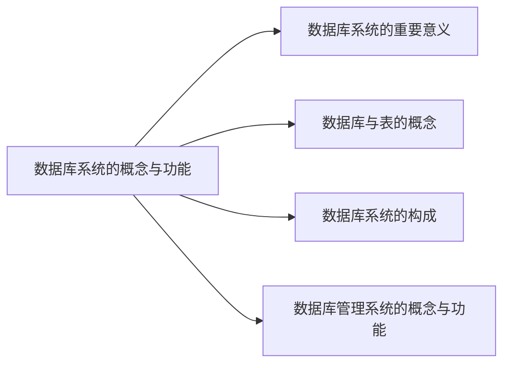

# 模型与语言

## 1 数据库系统概述

### 1.1 数据库系统的概念与功能

*数据库系统的重要意义：*

> Everything Over DB

- <u>数据库可以实现**信息的积累与运用**</u>
  - 积累：**形成数据库**
  - 运用：将积累的信息转换为**效益**
  - 提供数据库的**管理与控制**功能

- <u>数据库是**大数据**技术的基础</u> 
  - 只求**关系**，不求因果
  - 从**部分数据集**上的分析，到**全数据集**上的分析

---

*数据库与表的概念：*

- <u>数据库的概念</u>：

  - 数据库是**电子化信息**的集合
  - 数据库是相互之间**有关联关系的表**的集合

- <u>表的概念</u>：以**按行按列**形式组织及展现的数据

  > 表也可以称之为**关系**

- <u>表的构成</u>：

  - 表名
  - 表标题（格式）
  - 表内容（值）
  - 表结构
    - 行(row)/元组(tuple)/记录(record)
    - 列(column)/字段(field)/属性(attribute)/数据项(data item)

- <u>表的作用</u>：

  - 表中描述了一批相互有**关联关系**的数据
  - 基于表提出了**关系及关系模型**，提出了**关系数据库**

---

*数据库系统的构成：*

-   数据库(DB)：DataBase，相互之间有关联关系的表的集合
-   数据库管理系统(DBMS)：DataBase Management System，管理数据库的系统软件
-   数据库应用(DBAP)：DataBase APplication，完成某种数据库相关功能的应用程序
-   数据库管理员(DBA)：DataBase Administrator
-   计算机基本系统

---

*数据库管理系统的概念与功能：*

- <u>概述</u>：数据库管理系统一种系统软件，它通过**结构化数据库语言**提供基本的数据库操作功能，运行程序**解析**语言并**执行**对数据库的具体操作

- <u>提供数据库语言(SQL, Structrued Query Language)</u>

    >   主要从**用户使用**的角度讲解

    >   数据库语言：DBMS提供的用于**指示DBMS操作数据库**的语言，相当于高级语言的一个或多个循环程序，可以嵌入高级语言（宿主语言）中使用

    - 数据定义语言(DDL, Data Definition Language)：**定义**数据库中表的名称、标题（包括属性名及对属性值的要求）等**格式**，**创建**数据库和表

        >   也包括对数据库和表的删除、更改、查询

    - 数据操纵语言(DML, Data Manipulation Language)：对数据库中的表进行**增加、删除、更改、检索**等操作

    - 数据控制语言(Data Control Language)：规定**用户**操作**数据**的**权限**，实施对数据库的**控制**

    - 数据库维护程序：提供对数据库维护的功能，包括转储、恢复、重组、性能检测、分析等，一般由DBA使用

- <u>运行系统例行程序</u>

    >   主要从**系统实现**的角度讲解

    >   这些例行程序本质上是用<u>**形式$\rarr$构造$\rarr$自动化**</u>的思想**实现**数据库管理系统

    - **编译**与执行控制程序
        - 将数据库语言翻译成DBMS可执行的命令（DDL编译器、DML编译器、DCL编译器等）
    - **查询**优化与查询实现程序
        - 提高数据库**检索速度**
        - 执行引擎**实现查询**
    - **存储与索引**程序
        - 提供数据在**外存**上的**高效存取**手段
        - 实现存储管理器、缓冲区管理器、索引/文件和记录管理器等
    - **事务**处理程序
        - 提高可靠性，避免并发错误
    - 各种**控制**程序
        - 通信控制：提供网络环境下数据操作与传输手段
        - 故障恢复、安全性和完整性控制
        - 数据库维护和数据字典管理
        - 应用程序接口

    >   详见数据库系统笔记仓库

### 1.2 数据库系统的抽象结构

模式

数据模型

发展

## 2 关系模型

# 建模与设计

# 管理与技术
